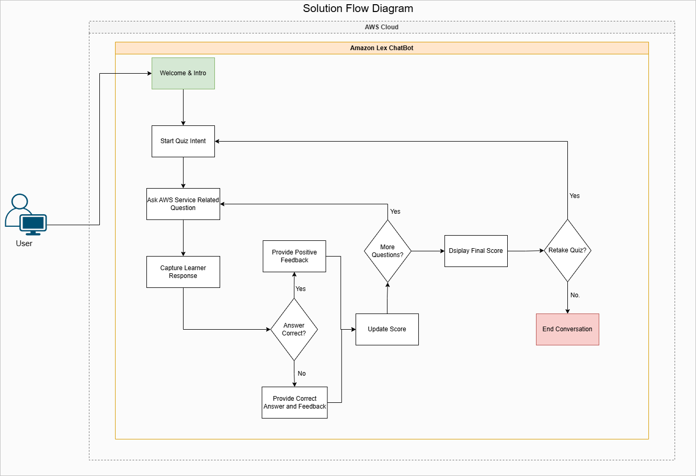
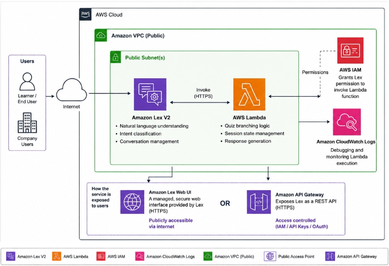

# AWS-re-Start-Lex-Chatbot-Project

## Authors
---

View Contributors/Authors

>aka Group 6

- Masekela Isaac Maake  

- Gugulethu Oliphant  

- Mr. Raven Phadagi  

- Tumelo Moyi  

---

### Introduction
The aim of this project is to design a chatbot using AWS Lex. 

---

### 1. Business Context & Requirements
#### Business Context
Cloud Learners Inc. is an educational technology startup that provides online training and certification preparation for cloud computing, with a focus on Amazon Web Services (AWS). To improve learner engagement and reinforce knowledge after lessons, the company wants to introduce an interactive chatbot that can quiz learners on AWS concepts.

Rather than presenting learners with a traditional multiple-choice assessment, the company aims to provide a conversational quiz experience using Amazon Lex. 

The initial implementation will focus on AWS CodeCommit, with the possibility of expanding the chatbot to cover additional AWS services such as Amazon EC2, AWS Lambda, Amazon VPC, and AWS IAM in the future.

#### Business Requirements
The chatbot should:

- Welcome learners and introduce the quiz.
- Explain the quiz rules before starting.
- Ask a series of questions about Amazon CodeCommit.
- Accept user responses through natural language.
- Determine whether each answer is correct or incorrect.
- Provide immediate feedback after every question.
- ***Maintain the learner's score throughout the quiz.***
- ***Display the final score at the end of the quiz.***
- Ask whether the learner would like to retake the quiz.
- End the conversation politely if the learner chooses not to continue.

#### Functional Requirements
Functional requirements describe What the system must do.
The solution must:

- Be developed using Amazon Lex.
- Support conversational interactions through intents and sample utterances.
- Guide users through the quiz using prompts and responses.
- Validate user input where necessary.
- Keep track of quiz progress.
- Calculate and display the learner's final score.
- Provide a simple and user-friendly conversational experience.

### Non-Functional Requirements

The chatbot should be:

- Easy to use for beginner cloud learners.
- Responsive, with minimal delays between questions.
- Accurate in evaluating user responses.
- Easy to maintain and extend with additional AWS service quizzes.
- ***Available through supported Amazon Lex deployment channels.***

### 2. Amazon Lex Overview
#### What is Amazon Lex?

Amazon Lex is a fully managed AWS service for building conversational chatbots that interact with users through text or voice. It enables developers to create chatbots capable of understanding user input, managing conversations, and providing interactive responses.

Originally, Amazon Lex was designed around Natural Language Understanding (NLU), where developers manually define the chatbot's **intents**, sample **utterances**, **slots**, and **conversation flow**(logic).

Amazon Lex has introduced support for Large Language Models (LLMs) through integration with services such as Amazon Bedrock, allowing developers to build more intelligent and flexible conversational experiences.

For this project, the traditional Amazon Lex approach was selected

### 3. Solution Overview
The proposed solution is an interactive rule-based quiz chatbot developed using Amazon Lex. This solution follows a predefined conversational flow. The chatbot uses intents, sample utterances, slots, and preconfigured responses to guide learners through the quiz and provide immediate feedback based on their answers. The flow diagram of the solution is shown in the image below.

When a learner starts the chatbot, they are welcomed and introduced to the quiz. The chatbot then asks a series of Amazon S3 questions, one at a time. After each response, the chatbot evaluates the answer against predefined correct answers, informs the learner whether their answer is correct or incorrect, and updates their score. Once all questions have been completed, the chatbot displays the learner's final score and offers the option to retake the quiz or end the conversation.

The architecture of the AWS solution is displayed below:

As illustrated in the architecture diagram, learners or employees interact with the chatbot through the internet using a web interface or an application integrated with Amazon Lex. User messages are sent securely over HTTPS to Amazon Lex, which interprets the learner's intent and manages the conversation.

**AWS Lambda** function is invoked whenever **business logic** is required—such as validating quiz answers, determining the next question, managing the learner's progress, or calculating the final score. The Lambda function processes the request and returns the appropriate response to Amazon Lex, which then presents it to the learner.

**IAM** is used to control access between Amazon Lex and AWS Lambda using IAM permissions to ensure that only the authorised chatbot can invoke the Lambda function. Throughout execution, Lambda automatically sends logs to **Amazon CloudWatch Logs**, allowing developers to monitor chatbot activity, identify errors, and troubleshoot issues during development and after deployment.

#### 3.1 Benefits of this Architecture

The proposed architecture provides several advantages:

- Serverless: No servers or infrastructure need to be provisioned or maintained.
- Scalable: AWS automatically scales the chatbot based on user demand.
- Secure: IAM enforces secure communication between AWS services, while all user communication occurs over HTTPS.
- Highly Available: Amazon Lex and AWS Lambda are fully managed services designed for high availability.
- Cost-effective: Resources are consumed only when learners interact with the chatbot.
- Maintainable: Business logic is isolated within AWS Lambda, making it easy to update quiz questions and functionality without modifying the chatbot's conversational design.

#### 3.2 Solution Cost to the Client
| AWS Service                      | Usage Assumption                           | Estimated Monthly Cost (USD) | Estimated Monthly Cost (ZAR) |
| -------------------------------- | ------------------------------------------ | ---------------------------: | ---------------------------: |
| Amazon Lex V2                    | 1,000 text requests                        |                        $0.75 |                   **R13.88** |
| AWS Lambda                       | 1,000 invocations (within Free Tier)       |                        $0.00 |                    **R0.00** |
| AWS IAM                          | Identity and access management             |                        $0.00 |                    **R0.00** |
| Amazon CloudWatch Logs           | Log storage and monitoring (minimal usage) |                        $0.10 |                    **R1.85** |
| **Total Estimated Monthly Cost** |                                            |                    **$0.85** |                 **≈ R15.73** |

***Note the following***:
- Amazon Lex is the primary cost driver, as charges are based on the number of text requests.
- AWS Lambda is expected to remain within the AWS Free Tier for this level of usage, resulting in no additional cost.
- IAM is provided at no charge.
- CloudWatch Logs incurs only a small cost due to the limited volume of log data generated.

#### 3.3 Solution Rollout
Depending on the **organisation's requirements**, the **Group 6** cloud practitioner's chatbot can be made available in several ways:

- **Amazon Lex Web UI**, allowing learners to access the chatbot directly through a web browser.
- A custom **web or mobile application**, where developers integrate the application with Amazon Lex using the AWS SDK or APIs.
- **Amazon API Gateway**, if the organisation wants to expose the chatbot through a RESTful API for integration with other systems e.g., A learning Solution.

#### 3.4 Lessons Learnt
While the project focused on a relatively simple educational chatbot, it highlighted several important lessons about cloud-native development, managed services, and modern application architecture.

- One of the key lessons learnt was the value of using managed cloud services. Rather than building a chatbot framework from scratch, Amazon Lex provides built-in capabilities for natural language understanding, intent recognition, and conversation management. Similar with AWS Lambda.

- A common misconception is that cloud solutions are expensive and are only suitable for large organisations. This project demonstrated that many AWS services operate on a pay-as-you-use pricing model, making them affordable even for students, startups, and small businesses. This shows that organisations can build professional, scalable applications without making significant upfront investments in servers or infrastructure.

- Another important lesson is that many organisations are unaware of the capabilities offered by AWS beyond virtual machines and storage. For example, Amazon Lex enables organisations to create conversational interfaces for customer support, employee self-service, educational platforms, and knowledge assistants without requiring expertise in artificial intelligence or machine learning. 

- This project showed that a traditional rule-based chatbot is often the better choice when the conversation follows a predictable structure.For a knowledge-check quiz, predefined intents, utterances, and responses provide greater control, consistency, and accuracy than AI-generated responses. This reinforces **the importance of selecting technology based on business requirements rather than current trends**.

- The project highlighted the importance of separating different responsibilities within the application architecture. Each AWS service performs a specific role, this separation of concerns makes the solution easier to maintain, troubleshoot, and extend.

#### 3.5 Challenges Encountered
- **Understanding Amazon Lex** : One challenge was understanding the difference between the traditional intent-based approach and the newer LLM-enhanced capabilities available through integrations such as Amazon Bedrock. **Choosing the most appropriate approach** required understanding the project requirements rather than simply adopting the newest technology.
- **Designing Effective Conversations**: Creating an engaging conversational experience required careful planning of intents, sample utterances, prompts, and responses.
- **Managing Quiz Logic**: Although the chatbot itself was relatively simple, managing quiz progression, score calculation, and branching logic required careful consideration. Separating these responsibilities into AWS Lambda simplified the overall chatbot design and improved maintainability.
- **Understanding AWS Architecture**: Another challenge was distinguishing between a conversation flow diagram and a cloud architecture diagram. While both describe the system, they communicate different aspects of the solution. This highlighted the importance of selecting the appropriate type of diagram when **documenting** cloud-based applications.

#### 3.6 AWS Lex In Action
This section shows screenshots of the work done on the project and  AWS Lex Bot in action:

##### 3.6.1. Configuring the logic of the chatbot in AWS Lamda.

##### 3.6.2. The intents that were added for the chatbot

##### 3.6.3. The User trying out the Chatbot

### 4. Group 6 Tasks Delegation
The tasks for the project, amongst the group members, were assigned as follows:

| Team Member | Role / Responsibility | Contribution | Status |
|-------------|-----------------------|--------------|--------|
| **Isaac Maake** | Project Coordinator, Meeting Facilitator, GitHub Repository Administrator | Coordinated all group meetings, assigned tasks, monitored project progress, created and managed the GitHub repository, assisted with project integration and collaboration. | Completed |
| **Ravern Phadagi** | Amazon Lex Chatbot Development | Designed and implemented the Amazon Lex chatbot, including creating intents, utterances, and configuring the chatbot conversation flow. | Completed |
| **Gugulethu Oliphant** | AWS CodeCommit Chatbot Development | Developed the Amazon Lex intents and utterances related to AWS CodeCommit functionality and contributed to the chatbot's knowledge base. | Completed |
| **Tumelo Moyi** | Team Member | Attended the initial project meetings but did not contribute to the development or implementation of the project deliverables. | No Contribution |